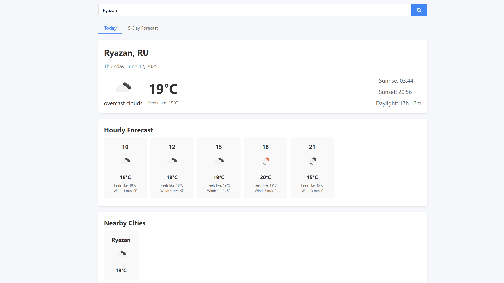
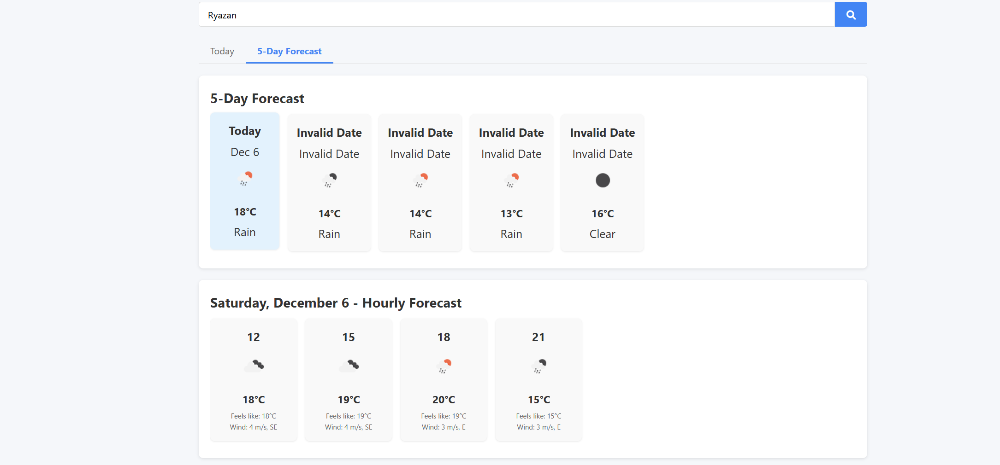

# Weather Forecast App

## Приложение для просмотра текущей погоды и прогноза на 5 дней с использованием OpenWeatherMap API.

## 🚀 Функционал
- Показ текущей погоды (температура, ощущается как, иконка погоды)
- Почасовой прогноз на сегодня
- Прогноз на 5 дней с детализацией по дням
- Поиск по городам
- Автоопределение местоположения
- Адаптивный дизайн

## 📦 Установка
1. Репозиторий:
   
   git clone https://github.com/ваш-username/weather-app.git

   ## Установка API ключ:

2. Зарегистрироваться на OpenWeatherMap

В файле modules/weatherService.js API_KEY = 'Ваш API'; ключ

## Структура проекта

├── index.html
├── README.md
├── app.js
├── styles.css
└── modules/
    ├── weatherApp.js
    ├── weatherService.js
    └── uiManager.js